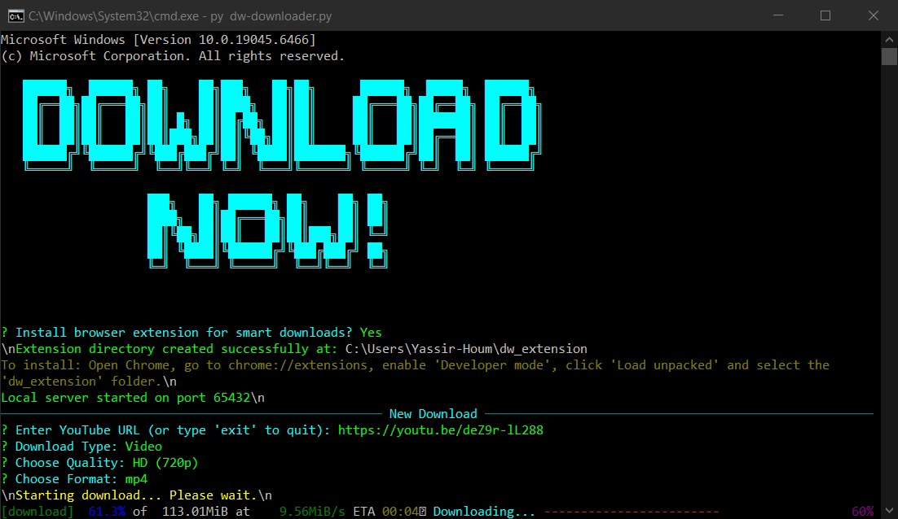
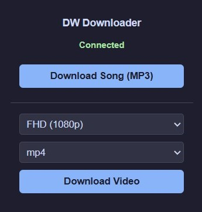

<p align="center">
  
  <br>
  <b>dw-downloader</b>
</p>


##  Description
**dw-downloader** is a modern, interactive, terminal-based video and audio downloader powered by `yt-dlp`. It features a sleek command-line interface with rich visuals and colors, making downloading videos from YouTube, TikTok, and other platforms a breeze. 


Beyond the terminal, it includes a **Smart Browser Extension** that seamlessly connects your browser to the terminal. It automatically detects playing videos (like TikTok feeds) and injects a convenient floating download button directly onto the screen for 1-click downloads straight to your PC!


##  Screenshots
| Terminal Interface | Smart Browser Extension |
|:---:|:---:|
|  |  |


## VIDEO

https://github.com/user-attachments/assets/dc89b4af-ee46-4271-bcbb-cfe113f30901

---

##  Features
-  **Beautiful CLI**: Interactive menus, rich progress bars, and ASCII art.
-  **Video & Audio**: Download high-quality videos (FHD, HD, SD) in MP4/MKV or extract audio as MP3.
-  **Smart Browser Integration**: Automatically installs a Chrome/Edge extension.
-  **Floating Download Button**: Extracts direct video URLs (even for infinite scrolls like TikTok) via a safe, floating UI button.
-  **Global Access**: Run the `dw` command from anywhere on your system.


## Requirements
Make sure you have Python installed. The required libraries are:
```txt
yt-dlp>=2023.11.16
questionary>=2.0.1
rich>=13.7.0
```


## Installation


Install directly from GitHub using `pip`:


```bash
pip install git+https://github.com/Yassir-Houm/dw-downloader.git
```


*(This will automatically install all dependencies and set up the `dw` command globally on your system).*


## Usage


### Using the Terminal
1. Open your terminal (CMD, PowerShell, etc.).
2. Type `dw` and press Enter.
3. Paste the URL of the video you want to download or follow the interactive prompts to choose the quality and format.


### Using the Browser Extension (Smart Downloads)
1. Run `dw` in your terminal for the first time. It will ask if you want to install the browser extension.
2. Say **Yes**. The extension files will be created in `C:\Users\YourName\dw_extension`.
3. Open your Chromium-based browser (Chrome, Edge, Brave), go to `chrome://extensions/`.
4. Enable **Developer mode** (top right) and click **Load unpacked**.
5. Select the `dw_extension` folder.
6. Now, whenever you watch a video on supported sites (like TikTok), a small floating **DW** button will appear at the bottom right. Click it while the `dw` script is running in the background to automatically start the download!


---
<p align="center">
Made with ❤️ by Yassir27
</p>


